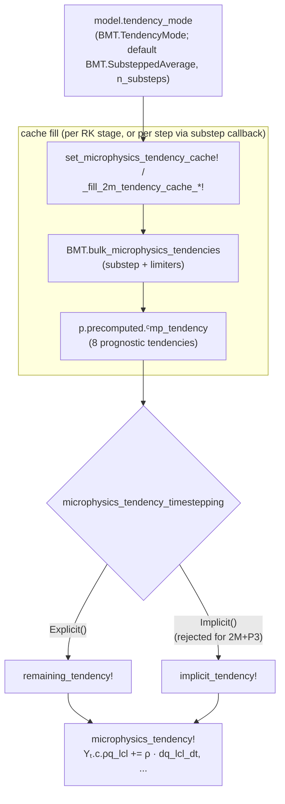

# Microphysics

## Source terms

Sources from cloud microphysics ``\mathcal{S}`` represent the transfer of mass
  between different water categories such as cloud water, cloud ice or precipitation,
  as well as the latent heat release due to phase changes.
The model supports three different cloud microphysics and precipitation representations:

- equilibrium cloud formation coupled with a 0-moment microphysics scheme,
- nonequilibrium cloud formation coupled with a 1-moment microphysics scheme
    representing both liquid and ice phase precipitation,
- nonequilibrium cloud formation coupled with a 2-moment warm-rain scheme
    unified with the P3 ice scheme (the 2-moment option always runs P3 ice).

The equilibrium 0-moment option does not introduce any new variables to the state vector.
The cloud condensate and phase partitioning are diagnosed using saturation adjustment
  and the 0-moment microphysics provides a sink on total water due to precipitation.
Precipitation is immediately removed from the computational domain.
The nonequilibrium 1-moment option expands the state vector by four microphysics tracers:
  cloud liquid water, cloud ice, rain and snow ``(q_\mathrm{lcl}, q_\mathrm{icl}, q_\mathrm{rai}, q_\mathrm{sno})``.
The nonequilibrium 2-moment + P3 option expands the state vector by the warm-rain
  mass and number concentrations together with the P3 ice variables; the full
  prognostic set is listed in [Prognostic state for 2-moment + P3](@ref) below.

All microphysics mass tracers are part of the working fluid
  and are defined as a ratio of the tracer mass over the mass of the working fluid.
The different cloud and precipitation source terms are provided by
  [CloudMicrophysics.jl](https://github.com/CliMA/CloudMicrophysics.jl) library
  and are defined as the change of mass normalized by the mass of the working fluid.
See the [CloudMicrophysics.jl docs](https://clima.github.io/CloudMicrophysics.jl/dev/)
  for more details.

Considering the transition from
  ``x \rightarrow y`` where ``x`` and ``y`` can be any of the microphysics tracers

```math
\mathcal{S}_{x \rightarrow y} := \frac{\frac{dm_x}{dt}}{m_{dry} + m_{vap} + m_{liq} + m_{ice} + m_{rai} + m_{sno}}
```

If ``\mathcal{S}_{x \rightarrow y}`` is a sink of ``q_{tot}`` from the 0-moment scheme
  it has a corresponding sink on density and energy:

```math
\frac{d}{dt} \rho =
\frac{d}{dt} \rho q_{tot} =
\rho \mathcal{S}_{x \rightarrow y}
```

```math
\frac{d}{dt} \rho e = \rho \mathcal{S}_{x \rightarrow y} (I_{y} + \Phi)
```

where ``I_{y}`` is the internal energy of the ``y`` phase.

In nonequilibrium cloud formation and the 1-moment and 2-moment schemes,
  since all microphysics tracers are part of the working fluid,
  microphysics sources do not introduce corresponding sources/sinks of
  total water, density or total energy.

!!! todo
    In the above derivations we are assuming that the volume
    of the working fluid is constant (not the pressure).

## Microphysics-numerics integration: the 2-moment + P3 averaging API

The microphysical source terms are supplied by
[CloudMicrophysics.jl](https://github.com/CliMA/CloudMicrophysics.jl).
For the nonequilibrium schemes, ClimaAtmos does not call the individual process
rates directly; it calls a single bulk-tendency entry point in the
`CloudMicrophysics.BulkMicrophysicsTendencies` module (abbreviated `BMT` below).
That entry point returns the per-step tendencies of the prognostic microphysics
variables, already combined across all active processes and time-averaged over
the model time step ``\Delta t``. This section explains how ClimaAtmos consumes
that API for the unified 2-moment warm-rain + P3 ice scheme
(`NonEquilibriumMicrophysics2M`), how it differs from the 1-moment consumption,
and why the integration is structured the way it is.

### The averaging mode lives on the model, not in the time stepper

Each nonequilibrium model carries a *bulk-tendency averaging mode*
(`tendency_mode`), a `BMT.TendencyMode` object that encapsulates how the bulk
tendency is averaged over the step and which sink limiter is applied. All
averaging modes substep the pointwise bulk tendency over ``\Delta t``; they
differ in how each substep is taken and in the increment limiter applied. The
defaults differ by scheme:

- 1-moment (`NonEquilibriumMicrophysics1M`) selects its mode from the
  `microphysics_averaging_mode` configuration option through
  `get_microphysics_tendency_mode_1m`: `"instantaneous"` maps to
  `BMT.Instantaneous`, `"linearized"` (the configured default) to
  `BMT.LinearizedAverage`, `"rosenbrock"` to `BMT.rosenbrock_donor`, and
  `"rosenbrock_exact"` to `BMT.rosenbrock_exact`. `BMT.LinearizedAverage` takes
  ``n_\mathrm{substeps}`` linearized-implicit (Rosenbrock-Euler) substeps of size
  ``\Delta t / n_\mathrm{substeps}``: each substep linearizes the sink terms in
  their donor species and advances the increment with a linear solve. It forwards
  to `BMT.rosenbrock_donor`, the donor-Jacobian configuration of the unified
  Rosenbrock framework (see the [CloudMicrophysics bulk-tendency
  documentation](https://clima.github.io/CloudMicrophysics.jl/dev/BulkTendencies/)
  and the [Rosenbrock substepping
  documentation](https://clima.github.io/CloudMicrophysics.jl/dev/RosenbrockNumerics/)).
  The 1-moment model also carries a separate substep count `n_substeps_quad` for
  the subgrid-scale quadrature path.
- 2-moment + P3 (`NonEquilibriumMicrophysics2M`) defaults to
  `BMT.SubsteppedAverage`, in which the bulk tendency is advanced with explicit
  forward-Euler substeps of size ``\Delta t / n_\mathrm{substeps}`` and the
  step-averaged result is returned.

The mode carries its own substep count ``n_\mathrm{substeps}``. The averaging
mode and its substep count are properties of the *model*, selected at
construction from configuration; they are independent of the IMEX time-stepping
split discussed below. With ``n_\mathrm{substeps} = 1`` the substepped average
reduces to a single bulk-tendency evaluation followed by the mode's limiter.

!!! note "Convergence of the 2-moment + P3 default"
    A consistent increment limiter must vanish as the substep size
    ``h = \Delta t / n_\mathrm{substeps} \to 0``; otherwise it biases the
    converged solution. The default `BMT.SubsteppedAverage` limiter for 2-moment +
    P3 scales the condensation and deposition tendencies by a saturation-mass
    ratio that does not depend on ``h``, so it does not vanish under substep
    refinement. Warm-rain and cold/ice states still converge, but mixed-phase
    states do not: the limiter zeros the ice sink while passing the rain-number
    source from ice melting, over-producing rain number in mixed-cold states, and
    it has no per-substep positivity floor, so it can drive the ice mass negative
    in mixed-warm states. `BMT.rosenbrock_exact` instead uses an increment
    limiter that activates only when a substep would cross saturation and scales
    the whole increment by a fraction, so it vanishes as ``h \to 0`` and converges
    in all regimes. It is the convergent alternative for 2-moment + P3. Forming the
    exact Jacobian makes a single microphysics evaluation roughly an order of
    magnitude more expensive than the explicit `BMT.SubsteppedAverage`; amortized
    over a full coupled step — dynamics, transport, turbulence, radiation — the
    full-step cost difference is much smaller, and is small wherever microphysics is
    a fraction of the step.
    Making the `BMT.SubsteppedAverage` limiter substep-consistent and adding a
    positivity floor is being addressed so that 2-moment + P3 explicit averaging
    is both inexpensive and convergent.

The model type itself is not parameterized by the (configuration-selected)
concrete mode: `tendency_mode` is declared with the abstract type
`BMT.TendencyMode`. Type stability is recovered by a function barrier at the
`bulk_microphysics_tendencies` call site, which dispatches on the concrete mode.

### Saturation-adjustment and coupled-sink limiting

On the grid-mean path the averaging mode applies two limiters internally before
returning the step tendency. A saturation-adjustment limiter bounds the net
condensation/deposition increment so that it does not overshoot the
more-supersaturated phase over the step. A coupled-sink limiter scales the
warm-rain mass/number sink pairs (``q_\mathrm{lcl}``/``n_\mathrm{lcl}`` and
``q_\mathrm{rai}``/``n_\mathrm{rai}``) by a single factor per pair, so that a
mass sink cannot remove more than the available mass over ``\Delta t`` while
keeping the paired number tendency consistent.

The two paths apply these limiters differently. The grid-mean path calls the
averaged entry point, so both limiters and the substep-averaging are internal to
the mode. The EDMF path instead calls the *unaveraged* (instantaneous) entry
point once per subdomain and applies only the coupled-sink factor in ClimaAtmos
after each call (see below); it does not substep-average and does not apply the
saturation-adjustment limiter, so the per-subdomain tendency is the raw
instantaneous bulk tendency with coupled-sink limiting only.

### Cache-fill cadence: per-RK-stage versus per-time-step

ClimaAtmos evaluates the bulk tendency once and stores it in the precomputed
cache (`p.precomputed.ᶜmp_tendency`, or the per-subdomain
`ᶜmp_tendencyʲs`/`ᶜmp_tendency⁰` for EDMF), then applies the cached values as a
forcing in the prognostic equations. The cadence at which the cache is refilled
differs by scheme:

- 1-moment: the cache is filled once per Runge-Kutta stage, from
  `set_microphysics_tendency_cache!`.
- 2-moment + P3: the cache can instead be filled once per time step, in a
  callback (`microphysics_substep_callback!`), controlled by the
  `microphysics_substep_callback` option on `AtmosWater`. When that option is
  set, the per-stage fill is skipped, so every RK stage of the step sees the same
  (substep-averaged) forcing. Holding the forcing constant across the stages
  gives the implicit Newton iterations a smoother explicit right-hand side. When
  the option is off, the 2-moment + P3 cache is filled per stage like the
  1-moment cache.

For the grid-mean 2-moment + P3 path, the cache fill calls the averaged entry
point directly,

```julia
ᶜmp_tendency = BMT.bulk_microphysics_tendencies(
    mode, BMT.Microphysics2Moment(), cm2p, thp, ρ, T, q_tot,
    q_lcl, n_lcl, q_rai, n_rai, q_ice, n_ice, q_rim, b_rim, logλ, dt,
)
```

where `mode` is the model's `tendency_mode`. The returned named tuple carries the
eight applied prognostic tendencies
``(\dot q_\mathrm{lcl}, \dot n_\mathrm{lcl}, \dot q_\mathrm{rai}, \dot n_\mathrm{rai}, \dot q_\mathrm{ice}, \dot n_\mathrm{ice}, \dot q_\mathrm{rim}, \dot b_\mathrm{rim})``.
In the EDMF path the unaveraged entry `BMT.bulk_microphysics_tendencies(BMT.Microphysics2Moment(), ...)`
is called once per subdomain (updrafts and environment) and the coupled-sink and
aerosol-activation increments are applied by ClimaAtmos around those calls.
Aerosol activation is also applied in the grid-mean (non-EDMF) path.

### The IMEX split is a separate axis

The IMEX (implicit-explicit) time integrator splits the right-hand side into a
part advanced implicitly and a part advanced explicitly. Which of the two
tendency functions evaluates the microphysics forcing is selected by
`microphysics_tendency_timestepping`, an `Explicit()`/`Implicit()` marker on
`AtmosWater` (set from the `implicit_microphysics` configuration). With
`Explicit()` the microphysics forcing is added in `remaining_tendency!`; with
`Implicit()` it is added in `implicit_tendency!`.

This split is the only role of `microphysics_tendency_timestepping`. It is
orthogonal to the averaging mode: the mode decides how the bulk tendency is
averaged over the step (and how many substeps it takes), while the split decides
in which tendency function the already-computed forcing is applied.

For 2-moment + P3 the two are not independent in one respect. The
substep-averaged 2-moment + P3 tendency is a constant explicit forcing for the
step: it is filled before the IMEX solve and held fixed across the step's
stages. An implicit IMEX treatment of a forcing that does not depend on the
current Newton iterate would contribute no microphysics-reaction term to the
Jacobian, so it would be implicit in name only. ClimaAtmos therefore rejects
`implicit_microphysics = true` together with 2-moment + P3 microphysics with an
error rather than constructing such a configuration. Any genuinely implicit
substepping lives inside the CloudMicrophysics averaging mode, not in the
ClimaAtmos IMEX split.

### Data flow



### Prognostic state for 2-moment + P3

The unified 2-moment warm-rain + P3 ice scheme always runs P3 ice. Its
prognostic state comprises total water, the cloud condensate and number
concentrations, and the P3 ice variables:

```math
(\rho q_\mathrm{tot},\ \rho q_\mathrm{lcl},\ \rho q_\mathrm{ice},\ \rho n_\mathrm{lcl},\ \rho n_\mathrm{rai},\ \rho q_\mathrm{rai},\ \rho n_\mathrm{ice},\ \rho q_\mathrm{rim},\ \rho b_\mathrm{rim}).
```

Here ``\rho q_\mathrm{lcl}`` and ``\rho n_\mathrm{lcl}`` are cloud-liquid mass and
number, ``\rho q_\mathrm{rai}`` and ``\rho n_\mathrm{rai}`` are rain mass and
number, and the P3 ice category is described by a single ice mass
``\rho q_\mathrm{ice}``, ice number ``\rho n_\mathrm{ice}``, rime mass
``\rho q_\mathrm{rim}``, and rime volume ``\rho b_\mathrm{rim}``. The single ice
mass field is named ``\rho q_\mathrm{ice}`` (distinct from the 1-moment cloud-ice
field ``\rho q_\mathrm{icl}``). The 2-moment + P3 scheme has no snow category: it
carries no ``\rho q_\mathrm{sno}``, whereas the 1-moment scheme keeps both cloud
ice ``\rho q_\mathrm{icl}`` and snow ``\rho q_\mathrm{sno}``.

The surface frozen-precipitation flux is stored in a scheme-agnostic field,
`surface_frozen_precip_flux`. For 1-moment it accumulates both the snow and
cloud-ice contributions; for 2-moment + P3, which has no snow, it is the
ice-only contribution. The same field name is used in both cases so that
downstream consumers (for example the coupler) need not know which scheme is
active.

## Sedimentation

All microphysics tracers sediment with a bulk (group) sedimentation velocity.
The sedimentation velocity can be parameterized via CloudMicrophysics.jl or, for
the 1-moment scheme, specified as a fixed value for each tracer. The 2-moment /
P3 scheme always uses diagnostic terminal velocities (the `fixed_terminal_velocity`
option does not apply to it).

Sedimentation is done implicitly through a first-order upwinding scheme.
Because all tracers are part of the working fluid, their sedimentation
  results in sedimentation terms for density and total energy.

!!! todo
    We assume that all microphysics tracers are at ambient air temperature.
    It would be more correct to assume that the microphysics tracers are
    at wet bulb temperature.

## Stability and positivity

Microphysics tracers should remain positive throughout the simulation.
The numerics of the model however, may result in errors that lead to the spurious formation
  of small negative numbers.
Most common causes of those errors are:

- spurious oscillations caused by the high order horizontal transport scheme,
- time integration of microphysics sources at time-step that is longer than the stability limit,
- use of hyperdiffusion.
Our strategy is to minimize the untoward effects of those errors.

### Implicit treatment of microphysics sinks

Microphysical processes can produce large negative tendencies (sinks) for tracer variables. These tendencies are handled through a time-averaged formulation in CloudMicrophysics.jl, in which sink terms are locally linearized and incorporated into the time integration scheme (see [here](https://clima.github.io/CloudMicrophysics.jl/dev/BulkTendencies/)).

### Enforcing physical constraints

An additional correction is applied through the callback

```
enforce_physical_constraints!(Y, p, t, turbconv_model)
```

This function applies local corrective updates to keep prognostic variables
in a physically admissible range.

Currently, this includes:

- enforcing non-negative condensate masses,
- for two-moment microphysics, enforcing non-negative warm-rain number
  concentrations (the P3-frozen ice fields are kept self-consistent by the
  microphysics scheme rather than clipped field-by-field here),
- rescaling condensate when the total condensate exceeds total moisture,
- handling non-positive updraft area fractions by mixing the affected updraft
  state with the environment (EDMF filter),
- ensuring subdomain consistency ``\rho a^j \chi^j \le \rho \chi``.

These corrections are intended to prevent nonphysical states such as negative
tracer values or condensate mass exceeding the available total moisture.

### Hyperdiffusion

Hyperdiffusion (``\nabla^4`` operator) is a tendency applied
  in order to remove noise buildup at the small scales and improve the model stability.
It's more selective than standard diffusion operator, and applies the damping only
  at the smallest scales of the simulation without degrading the sharp features
  of the modeled tracers.

Hyperdiffusion is a higher order derivative operator, and as a result does not guarantee positivity.
The user has a choice to opt-in certain microphysics tracers to use hyperdiffusion.
By default hyperdiffusion is applied to total water and cloud tracers,
  but not precipitating tracers.
The magnitude of hyperdiffusion acting on precipitation tracers can be changed by
  adjusting the free parameter `tracer_hyperdiffusion_factor`.

### Diffusion

ClimaAtmos provides different horizontal and vertical diffusion schemes that can be used
  to improve model stability and reduce the negative numbers and spurious oscillations.

Horizontal diffusion tendency is based on either the Smagorinsky-Lilly model
  [Sridhar2022](@cite) or the Anisotropic Minimum-Dissipation model (AMD) [Akbar2016](@cite)
  and is applied explicitly.

Vertical diffusion tendency can be based on either of the above models,
  or computed as a decaying with height function that is capped at some value above the tropopause.
Vertical diffusion can be applied implicitly.
When using the decay with height options (`VerticalDiffusion` or `DecayWithHeight`),
  similar to hyperdiffusion,  diffusion is applied to total water and cloud tracers.
The magnitude of diffusion acting on precipitation tracers can be scaled using the
  `tracer_vertical_diffusion_factor`.
There is no such scaling applied when using the Smagorinsky-Lilly or AMD models.

### Non-negativity constraints

Often, the diffusion and limiters described above are not enough to ensure positivity of the microphysics tracers.
ClimaAtmos supports three additional constraints that can be used to enforce non-negativity of the microphysics tracers.
This is controlled by the `tracer_nonnegativity_method` in the `AtmosWater` struct.
The availalble options are:

- `TracerNonnegativityElementConstraint`:
  This option enforces non-negativity by consistently ensuring that the mass of the tracer is conserved within the element.
  It uses the `Limiters.compute_bounds!` and `Limiters.apply_limiter!` functions to redistribute the mass of the tracer within the element
  such that the tracer concentration is non-negative and bounded by the maximum value in the element.
  Effectively, this method borrows mass from the neighboring nodes within the element to fill the negative holes.
  This method is conservative and does not introduce any source/sink of total water mass.

- `TracerNonnegativityVaporConstraint`:
  This option enforces non-negativity by borrowing mass from the water vapor.
  If a microphysics tracer ``q_x`` becomes negative at a given node, it is set to zero.
  Since the total water content ``q_{tot}`` is conserved during this operation, and ``q_{tot} = q_{vap} + \sum q_x``,
  setting a negative ``q_x`` to zero implicitly decreases ``q_{vap}``.

  ```math
  q_x = \max(0, q_x)
  ```

  This method is applied instantaneously at the end of each time step (or stage).
  It preserves the total water mass but redistributes it between phases.
  It should be used with caution as it can lead to negative water vapor if the negative hole in ``q_x`` is large, although
  usually the negative values are small and there is plenty of water vapor available.

- `TracerNonnegativityVaporTendency`:
  This option is similar to `TracerNonnegativityVaporConstraint` in that it borrows mass from water vapor,
  but it does so via a tendency term rather than an instantaneous adjustment.
  It computes a tendency that tends to restore the tracer to zero over the timestep ``\Delta t``.
  The tendency is limited by the available water vapor ``q_{vap}`` to avoid creating negative vapor.

  ```math
  \frac{\partial q_x}{\partial t} = \dots + \mathcal{S}_{fixer}
  ```

  where ``\mathcal{S}_{fixer}`` is positive if ``q_x < 0``.
  This method is less aggressive than the instantaneous constraint and integrates the correction into the time stepping scheme.

## Aerosol Activation for 2-Moment Microphysics

Aerosol activation uses functions from the [CloudMicrophysics.jl](https://github.com/CliMA/CloudMicrophysics.jl) library, based on the Abdul-Razzak and Ghan (ARG) parameterization. ARG predicts the number of activated cloud droplets assuming a parcel of clear air rising adiabatically. This formulation is traditionally applied only at cloud base, where the maximum supersaturation typically occurs.

To enable ARG to be used locally (i.e., without explicitly identifying cloud base), CloudMicrophysics.jl implements a modified equation for the maximum supersaturation that accounts for the presence of pre-existing liquid and ice particles. This allows activation to be applied inside clouds. To ensure that activation occurs only where physically appropriate, we apply additional clipping logic:

- If the predicted maximum supersaturation is less than the local supersaturation (i.e., supersaturation is decreasing), aerosol activation is not applied.
- If the predicted number of activated droplets is less than the existing local cloud droplet number concentration, activation is also suppressed.

This ensures that droplet activation occurs only in physically meaningful regions—typically near cloud base—even though the activation routine can be applied throughout the domain.

The activated droplet number is added as a source to the cloud droplet number tendency in both the EDMF subdomains and the grid-mean (non-EDMF) path, so the prognostic droplet number responds to cloud condensation nuclei in either configuration. When clouds are treated interactively in radiation, that prognostic droplet number `n_lcl` in turn sets the cloud liquid effective radius (via the Liu and Hallett (1997) relation, ``r_\mathrm{eff} \propto N_d^{-1/3}``). Together these close the aerosol indirect (Twomey) effect for two-moment microphysics, from cloud condensation nuclei through droplet number to cloud shortwave albedo.
