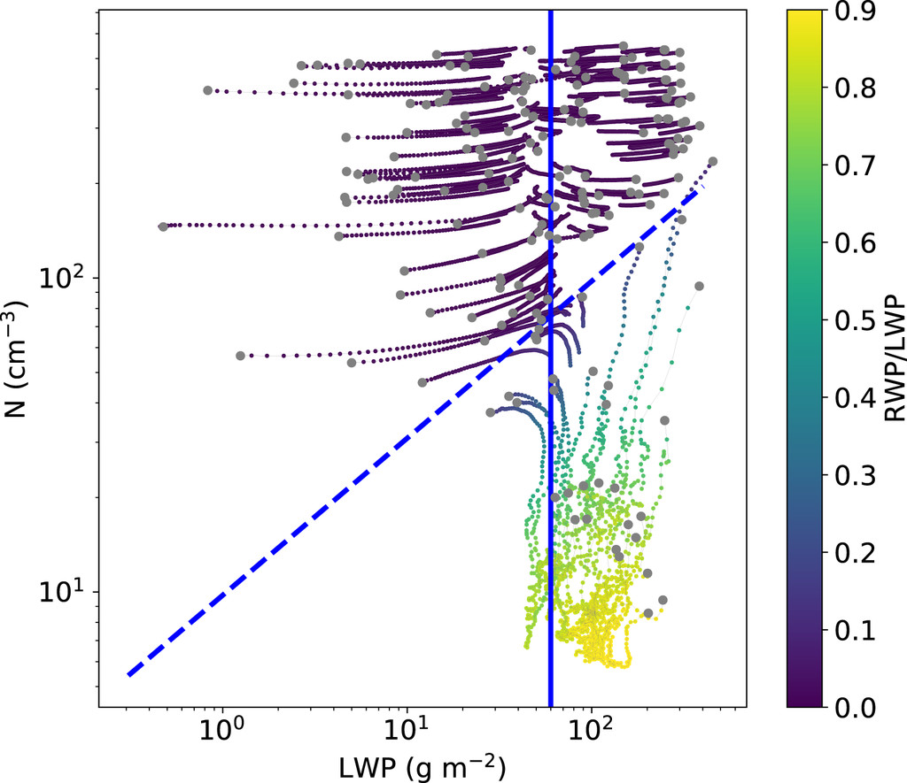

# Perturbed Initial Conditions Ensembles
With a bit of setup, ClimaAtmos can be used to run ensembles of perturbed initial conditions. Here, we will use perturbed DYCOMS-RF02 initial conditions to create a spread of simulated marine stratocumulus clouds in a single column configuration with the EDMF scheme and 2-moment microphysics. As an example, we will create something similiar to the figure below (Hoffmann, 2020) using ClimaAtmos.



# Creating Custom Config Arguments
In cases where it is of interest to run ensembles of the same model configuration but with perturbed initial conditions, it may be of use to add new keyword arguments to the .yml file. The idea is to allow modifications to initial conditions to be passed directly through the .yml file and then creating multiple copies of the files but with different variations and combinations of these parameters. 

As an example, we will explore modifying the total water mixing ratio (`q_tot_0`), liquid-ice potential temperature profiles (`theta_0` & `theta_i`), and initial boundary layer height (`z_i`) in the DYCOMS-RF02 simulation setup. 

### Modify initial_conditions.jl
To start, we need to go to the part of the source code responsible for defining the initial conditions. For both of the DYCOMS research flight simulation setups, the total water mixing ratio and liquid-ice potential temperature are pulled from another library called AtmosphericProfilesLibrary (APL).

There are many ways to modify the functions to allow for perturbation to the initial conditions, but for the sake of this example we will overwrite the function signature with our own version where we can pass in our own custom profiles. We must import the functions from the APL library and then define a new function with the same signature. This looks like:

```
import AtmosphericProfilesLibrary: Dycoms_RF02_θ_liq_ice, Dycoms_RF02_q_tot
[...]

# Redefine the profile functions here. Here we redefine the functions such that 
# we can pass in our own values for q_tot and θ_liq_ice, as well as modifying 
# the initial boundary layer height.

""" [Ackerman2009](@cite) """
Dycoms_RF02_θ_liq_ice(::Type{FT}, theta_0, theta_i, z_i) where {FT} =
    APL.ZProfile(z -> if z <= z_i
        FT(theta_0)
    else
        FT(theta_i) + (z - FT(z_i))^FT(1.0 / 3.0)
    end)

""" [Ackerman2009](@cite) """
Dycoms_RF02_q_tot(::Type{FT}, q_tot_0, z_i) where {FT} =
    APL.ZProfile(z -> if z <= z_i
        FT(q_tot_0) / FT(1000.0)
    else
        (FT(5) - FT(3) * (FT(1) - exp(-(z - FT(z_i)) / FT(500)))) / FT(1000)
    end)
```

Now that we have redefined our functions, we can pass these new functions to our intial conditions structure for the DYCOMS-RF02 setup. Here we can also begin to define our new keyword arguments that will serve as inputs for the new functions we defined. In the `DYCOMS_RF02` structure, we add the names of our new inputs:

```
Base.@kwdef struct DYCOMS_RF02 <: InitialCondition
    prognostic_tke::Bool = false
    q_tot_0_dycoms_rf02 # Define total water mixing ratio.
    theta_0_dycoms_rf02 # Define liquid-ice θ at surface.
    theta_i_dycoms_rf02 # Define liquid-ice θ at initial boundary layer height.
    z_i_dycoms_rf02 # Define initial boundary layer height.
end

for IC in (:Dycoms_RF01, :Dycoms_RF02)
    IC_Type = Symbol(uppercase(string(IC)))
    θ_func_name = Symbol(IC, :_θ_liq_ice)
    q_tot_func_name = Symbol(IC, :_q_tot)
    [...]
    if IC == :Dycoms_RF02
        @eval function (initial_condition::$IC_Type)(params)
            (; prognostic_tke, q_tot_0_dycoms_rf02, theta_0_dycoms_rf02, theta_i_dycoms_rf02, z_i_dycoms_rf02) = initial_condition #unpack the new arguments here. These arguments will be provided through the model .yml file.
            FT = eltype(params)
        [...]
            θ = $θ_func_name(FT, FT(theta_0_dycoms_rf02), FT(theta_i_dycoms_rf02), FT(z_i_dycoms_rf02)) # Change function signature here.
            q_tot = $q_tot_func_name(FT, FT(q_tot_0_dycoms_rf02), FT(z_i_dycoms_rf02)) # Change function signature here.
        end 
    else
        [...]
    end
end
```

### Add Keywords to .yml & Modify default_config.yml
Now that we have added a new keyword argument to be used in initial conditions, it is time to define the keyword argument in the YAML files responsible for configuring the model runs. In the YAML file for running a DYCOMS-RF02 single column experiment, we add and adjust the following lines: 

```
q_tot_0_dycoms_rf02: 9.45 # Define variables here.
theta_0_dycoms_rf02: 288.3 # Define variables here.
theta_i_dycoms_rf02: 295.0 # Define variables here.
z_i_dycoms_rf02: 795.0 # Define variables here.
```

These are the same default values being used by the original APL function, but we can modify it in the YAML file if we want to test different initial conditions. Additionally, we need to provide a backup default value in the case that the keyword argument is not used or provided in the setup YAML file. To do this, we go to default_config.yml and add the following:

```
q_tot_0_dycoms_rf02: # Additional variables here.
  help: "Surface total water mixing ratio for DYCOMS RF02."
  value: 9.45 # Default value.
theta_0_dycoms_rf02: # Additional variables here.
  help: "Surface liquid-ice potential temperature for DYCOMS RF02."
  value: 288.3 # Default value.
theta_i_dycoms_rf02: # Additional variables here.
  help: "Initial boundary layer liquid-ice potential temperature for DYCOMS RF02."
  value: 295.0 # Default value.
z_i_dycoms_rf02: # Additional variables here.
  help: "Initial boundary layer height."
  value: 795.0 # Default value.
```

### Modify type_getters.jl
Finally, we need to update type_getters.jl with our new keyword arguments as well. We find where DYCOMS-RF02 is specified and then we replace it with a separate block that looks like:

```
[...]
    elseif parsed_args["initial_condition"] == "DYCOMS_RF02"
        return getproperty(ICs, Symbol(parsed_args["initial_condition"]))(
            parsed_args["prognostic_tke"],
            parsed_args["q_tot_0_dycoms_rf02"], # Add parsed args here.
            parsed_args["theta_0_dycoms_rf02"], # Add parsed args here.
            parsed_args["theta_i_dycoms_rf02"], # Add parsed args here.
            parsed_args["z_i_dycoms_rf02"], # Add parsed args here.
        )
[...]
```

With this step complete, we are now ready to pass a new keyword argument that we defined ourselves to modify or change the initial conditions. The scripts currently contained in /examples/perturbed_dycoms_rf02 contain code for running the ensemble as well as post-processing/plotting capabilities.

# Creating & Running Ensembles
The script `pipeline.jl` handles this entire step without parallelized runs, but the steps can also be performed individually. 

The recommended workflow is the create multiple copies of the .yml files and label them according to the initial conditions used. For example, the default file might look like `prognostic_edmfx_dycoms_rf02_column_qtot0_9.45_theta0_288.3_thetai_295.0_zi_795.0_prescribedN_1.0e8.yml`.

We can use `make_yaml.jl` to generate multiple different configurations with ease. To do so, provide the function `make_yamls()` with a default file for which to copy, and an output path. This script uses nested for loops to generate every possible combination of parameters, and they can be altered directly in the file. This might look like:

```
include(joinpath(pkgdir(CA),"LWP_N_scripts", "make_yaml.jl"))

default_data_path = default_prog_2M
output_dir = prognostic_2M_config
make_yamls(default_data_path, output_dir, is_prog=true)
```

To use these configuration files, we can either parallelize or run them serially. If parallelization is desired, run: 

```
julia -p <num_processors> parallel_driver.jl
```

Be sure that the paths, which are handled by `all_paths.jl`, are referring to the right set of simulations. This example focuses in on prognostic EDMF+2M simulations, but the scripts have implementation for diagnostic EDMF as well as 1-moment microphysics as well.

# Visualizing Ensemble Output
After the simulations are done being ran, we can use `process_plot_outputs.jl` to visualize changes in the liquid water path (LWP) and cloud droplet number concentration (N), in order to recreate the figure above. An example code block to recreate the plot is shown below, but additionally plotting capabilities are demonstrated in `LWP_N_Experiments.ipynb`.

```
include(joinpath(pkgdir(CA), "LWP_N_scripts", "process_plot_outputs.jl"))
output_dir = output_2M
all_outputs = make_edmf_vec(output_dir)
filtered = filter_runs(all_outputs)
sampled = StatsBase.sample(filtered, 40; replace = false)

fig = plot_edmf(sampled, is_1M = false, is_time = false, save = false)
```
