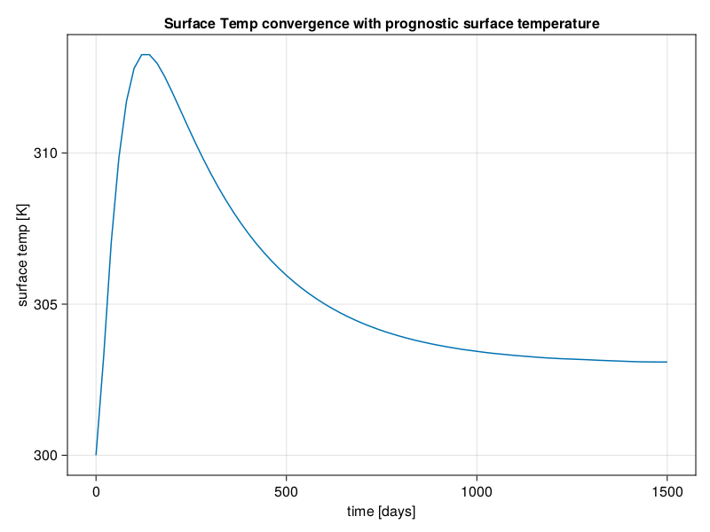
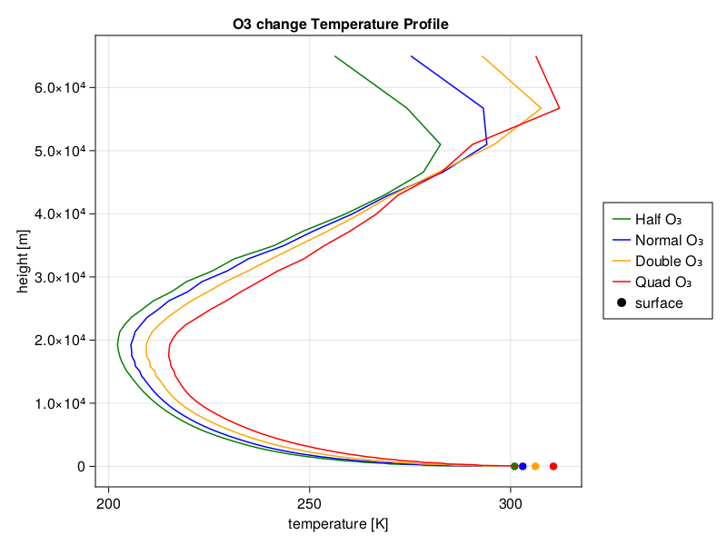
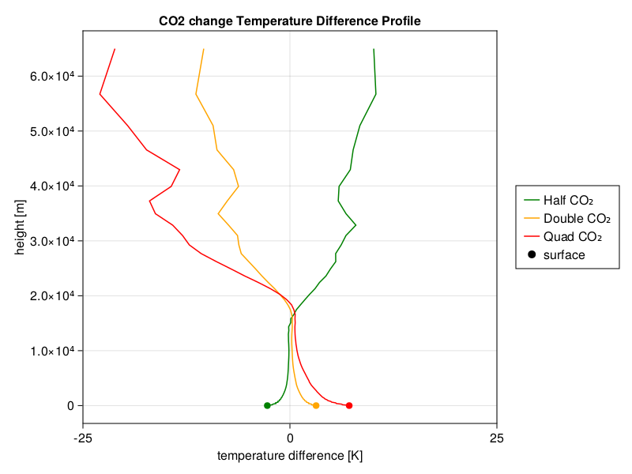

# Radiative Equilibrium Example
A suite of concrete examples are provided here as a guidance for running single column Radiative Equilibrium.  


# Radiative Equilibrium
Radiative equilibrium is a useful framework for analyzing atmospheric temperature profiles with different atmosphere conditions. In radiative equilibrium, we only consider heat exchange from radiation. In this example, we only match the total energy, and assume a fixed relative humidity to get specific humidity.

To run a radiative equilibrium simulation, create a yaml file (or use a default one) and run the following commands in your terminal (after instantiating the necessary packages):

The yaml file should look something like this:
`mysim.yml`
```
rad: "clearsky" 
idealized_h2o: true 
hyperdiff: "false" 
config: "column" 
initial_condition: "IsothermalProfile" 
z_max: 70000
z_elem: 70 
dz_bottom: 100 
dz_top: 10000 
t_end: "654days" 
dt: "3hours" 
dt_save_to_sol: "30hours" 
dt_save_to_disk: "100days" 
prognostic_surface: "true" 
job_id: "single_column_radiative_equilibrium_clearsky_prognostic_surface_temp"
```

Then run the simulation with the following command:
```
julia --project=examples examples/driver.jl --config_file path to mysim.yml
```

The configuration in the yaml file above can be changed to adjust to the kind of simulation desired. Options such as t\_end can be increased to the desired simulation time. Other arguments such as radiation type can be changed based on the options in `default_config.yml`.

After a simulation is ran the output files should be available in the output folder, where hdf5 files store all the simulation's data, and two mp4s should be produced with a vertical temperature profile and a vertical wind profile which change over time. If you want to quickly access data from the final day of the simulation simply add a -i to the command line input, like so:

```
julia -i --project=examples examples/driver.jl --config_file filepath
```

This will bring you into a julia environment where the current state of the simulation can be accessed. Run propertynames(Y) and propertynames(p) to see accessible values, some examples:


Here is a typical vertical temperature profile on the final day of a simulation (the dot is surface temperature):


Note: The surface temperature must also converge before the simulation reaches radiative equilibrium, here is a typical convergence of surface temperature plot:




# Greenhouse Gas Concentrations
In `radiation.jl` one can change the concentrations of greenhouse gases in order to test their effects on the atmospheric temperature profile.

To change the ozone concentration multiply the following variable by the desired coefficient:

```
center_volume_mixing_ratio_o3 =
                RRTMGPI.field2array(@. FT(pressure2ozone(default_cache.ᶜp))) * desired_coefficient
```


Here are the equilibrium temperature profiles under different ozone concentrations:




To change the CO2 concentration, multiply the volume mixing ratio by the desired coefficient:
```
volume_mixing_ratio_co2 = input_vmr("carbon_dioxide_GM") * desired_coefficient
```


Here are the equilibrium temperature profiles under different CO2 concentrations:




Similarly, one can change the concentration of any other gases in the atmosphere


# Data extraction in Julia
To access the data from hdf5 files one can use the following code to create a var `diagnostics` which stores values from a hdf5 file path:

```
import ClimaAtmos: time_from_filename
import ClimaCore: Geometry, Spaces, Fields, InputOutput
import ClimaComms
import CairoMakie: Makie
import Statistics: mean

function read_hdf5_file(file_path)
    reader =
        InputOutput.HDF5Reader(file_path, ClimaComms.SingletonCommsContext())
    diagnostics = InputOutput.read_field(reader, "diagnostics")
    close(reader)
    return time_from_filename(file_path), diagnostics
end

time, diagnostics = read_hdf5_file("sample/file/path")
```

`diagnostics` will contain the values from the state of the simulation at a given time. `propertynames(diagnostics)` can be useful for finding accessible values. For example, `diagnostics.sfc_temperature` contains the surface temperature at a given time in the simulation.
