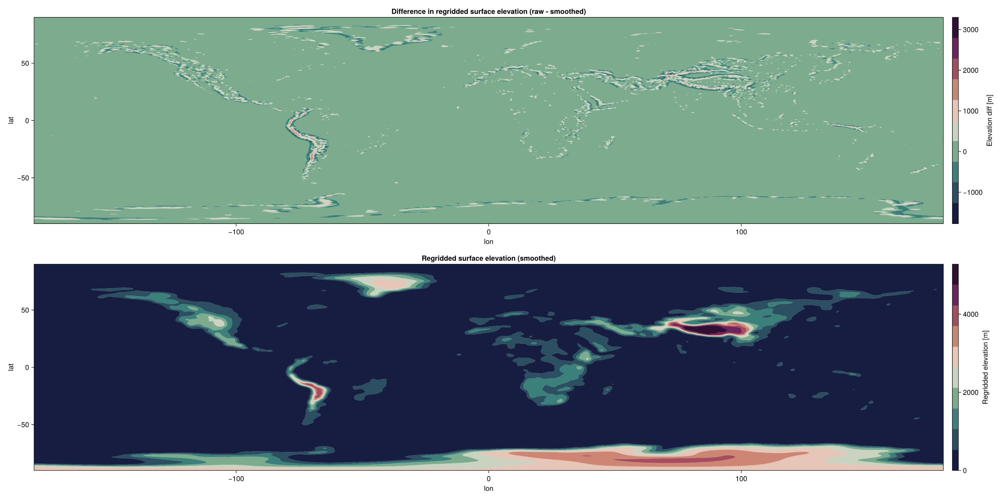

### Topography in ClimaAtmos

Dataset source : https://www.ncei.noaa.gov/products/etopo-global-relief-model
ClimaArtifact  : https://github.com/CliMA/ClimaArtifacts/tree/main/earth_orography 

We currently use the ClimaUtilities `SpaceVaryingInput` tool to regrid (using linear interpolation) the ETOPO2022 ice-surface elevation dataset (see ClimaArtifacts) onto the required spectral element horizontal grid. The file `examples/topography_spectra.jl` provides simple tools to generate such regridded fields (and their spectra) on user-defined horizontal spaces. For existing ClimaAtmos simulation data, users may access the `orog.nc` dataset from the default diagnostic outputs to visualize or examine this data. As an example, we include plots of the generated topography on a cubed sphere with 16 elements and 64 elements per panel edge, and compare instances of `unsmoothed` and `smoothed` datasets to visualize the effect of our topography smoothing methods. 

- Elevation data (elems per panel = 16)

- Elevation data (elems per panel = 64)

