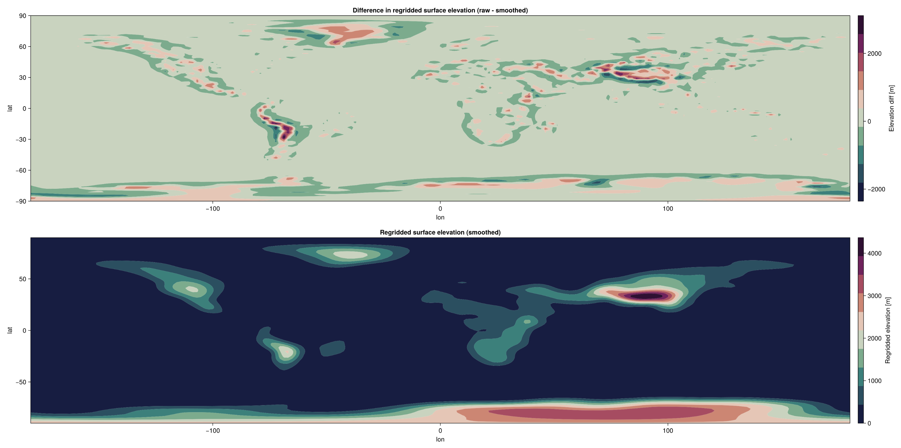
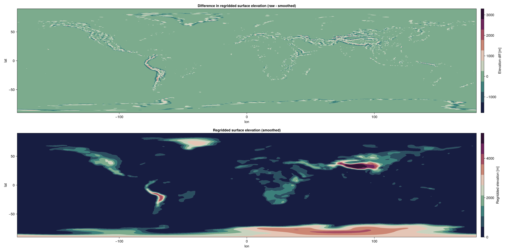

# Topography in ClimaAtmos

  - Dataset source: [https://www.ncei.noaa.gov/products/etopo-global-relief-model](https://www.ncei.noaa.gov/products/etopo-global-relief-model)
  - ClimaArtifact: [https://github.com/CliMA/ClimaArtifacts/tree/main/earth_orography](https://github.com/CliMA/ClimaArtifacts/tree/main/earth_orography)

We use the ClimaUtilities `SpaceVaryingInput` tool to regrid (using linear interpolation) the ETOPO2022 ice-surface elevation dataset (see ClimaArtifacts) onto the required spectral element horizontal grid. The file `examples/topography_spectra.jl` provides tools to generate such regridded fields (and their spectra) on user-defined horizontal spaces. For existing ClimaAtmos simulation data, the `orog_inst.nc` dataset from the default diagnostic outputs contains this regridded elevation. As an example, we include plots of the generated topography on a cubed sphere with 16 elements and 64 elements per panel edge, and compare `unsmoothed` and `smoothed` datasets to show the effect of our topography smoothing methods.

  - Elevation data (elems per panel = 16)
    

  - Elevation data (elems per panel = 64)
    
